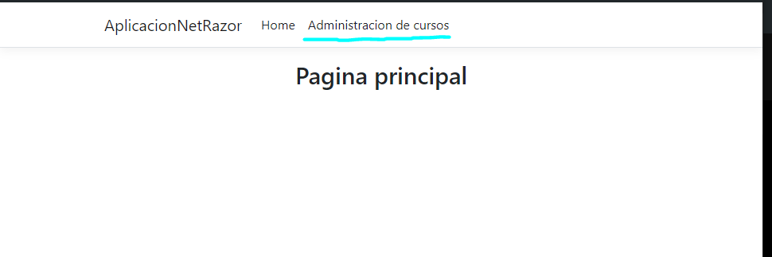
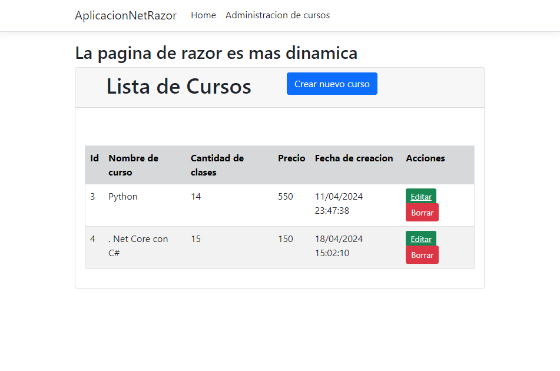
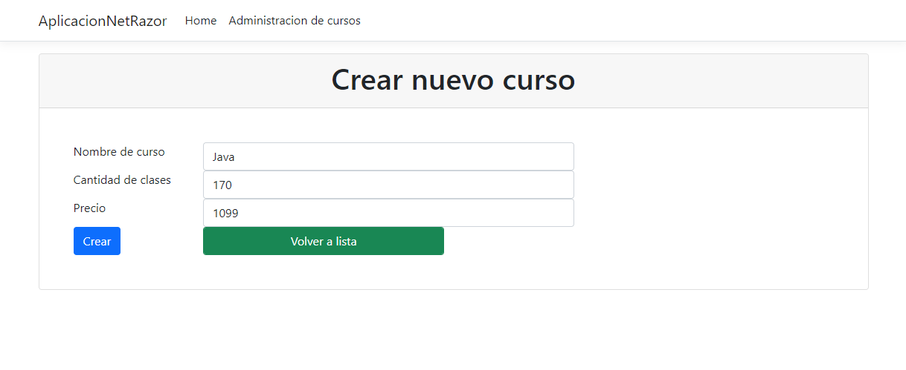
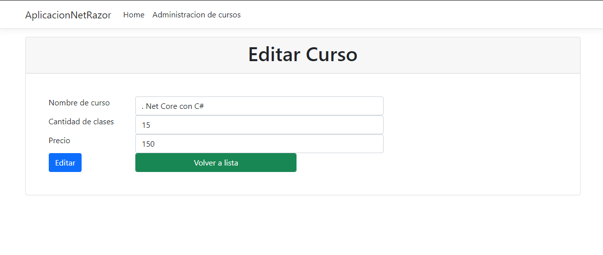
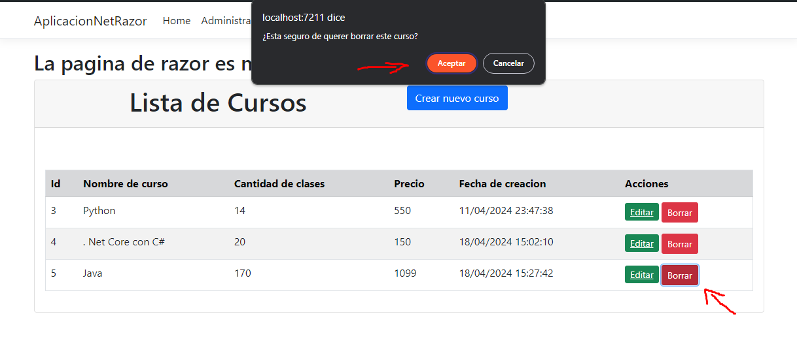
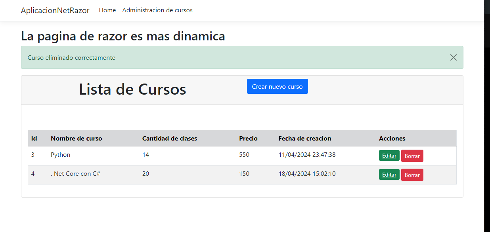

# Aplicación de Cursos con C#, .NET CORE (Páginas Razor)

## Requisitos (Conocimientos en):
- Base de Datos
- Lenguaje C#
- .NET CORE
- HTML
- Bootstrap

## Herramientas:
- Visual Studio
- SQL Server
- SQL Management Studio

Para que el sistema funcione es importante realizar los siguientes pasos:
1. Tener en cuenta que en la carpeta de ***Models*** se tiene la Entidad o Modelo (Tabla de la base de datos) *Curso.cs* el cuál hay que tenerlo.
2. Tener la carpeta ***Datos*** y su clase *ApplicationDbContext.cs* que debe tener la instancia de los Modelos necesarios.
3. Abrir la terminal.
4. Escribir en la terminal el siguiente cómando `Add-Migration NombreDeMigracion`
5. Aún no se ha creado la base de datos con el Modelo ni las relaciones, así que para que esto se muestre en el motor de base de datos se necesita el siguiente comando `Update-database`.

Con esos pasos ya se puede llegar a correr la aplicación si es que se llega a fallar.

## RESULTADO
### Página principal

### Página de administración de cursos

### Crear nuevo curso
Cuando presionemos el botón azul de *Crear nuevo curso* se abre la siguiente ventana.

### Editar nuevo curso

### Eliminar Curso

